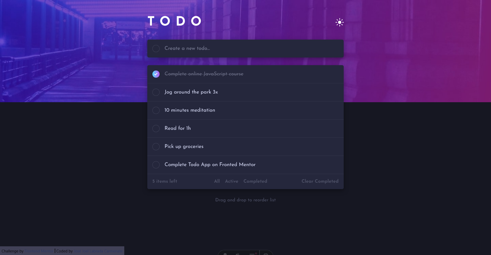

# Frontend Mentor - Todo app solution

This is a solution to the [Todo app challenge on Frontend Mentor](https://www.frontendmentor.io/challenges/todo-app-Su1_KokOW). Frontend Mentor challenges help you improve your coding skills by building realistic projects. 

## Table of contents

- [Frontend Mentor - Todo app solution](#frontend-mentor---todo-app-solution)
  - [Table of contents](#table-of-contents)
  - [Overview](#overview)
    - [The challenge](#the-challenge)
    - [Screenshot](#screenshot)
    - [Links](#links)
  - [My process](#my-process)
    - [Built with](#built-with)
    - [What I learned](#what-i-learned)
  - [Author](#author)

## Overview

### The challenge

Users should be able to:

- View the optimal layout for the app depending on their device's screen size
- See hover states for all interactive elements on the page
- Add new todos to the list
- Mark todos as complete
- Delete todos from the list
- Filter by all/active/complete todos
- Clear all completed todos
- Toggle light and dark mode
- **Bonus**: Drag and drop to reorder items on the list

### Screenshot

### Links

- Solution URL: [https://github.com/jojoboomer/frontend-projects](https://github.com/jojoboomer/frontend-projects)
- Live Site URL: [https://frontend-projects-self.vercel.app/todo](https://frontend-projects-self.vercel.app/todo)

## My process

### Built with

- [Vite](https://vite.dev/) - Build tool
- [Astro](https://astro.build/) - Framework
- [React](https://reactjs.org/) - JS library
- [Panda CSS](https://nextjs.org/) - Build-time CSS-in-JS library
- [Nanostore](https://www.npmjs.com/package/nanostores) - State manager ( tasks and theme state )
- [dnd-kit](https://nextjs.org/) - Drag & drop toolkit

### What I learned

I gained practical experience in implementing modern, accessible drag-and-drop functionality using the dnd-kit toolkit. I learned to create sortable lists and interactive components by working with its core concepts like DndContext, sensors, and collision detection algorithms. This project taught me how to manage complex state changes during drag operations, provide visual feedback to users, and build intuitive, responsive interfaces that enhance UX. Working with dnd-kit strengthened my understanding of React component architecture and front-end interactivity.

## Author

- Website - [JoeBoomer](https://www.your-site.com)
- Frontend Mentor - [@jojoboomer](https://www.frontendmentor.io/profile/jojoboomer)
- Linkedin - [@joellabrada](https://www.linkedin.com/in/joellabrada/)
