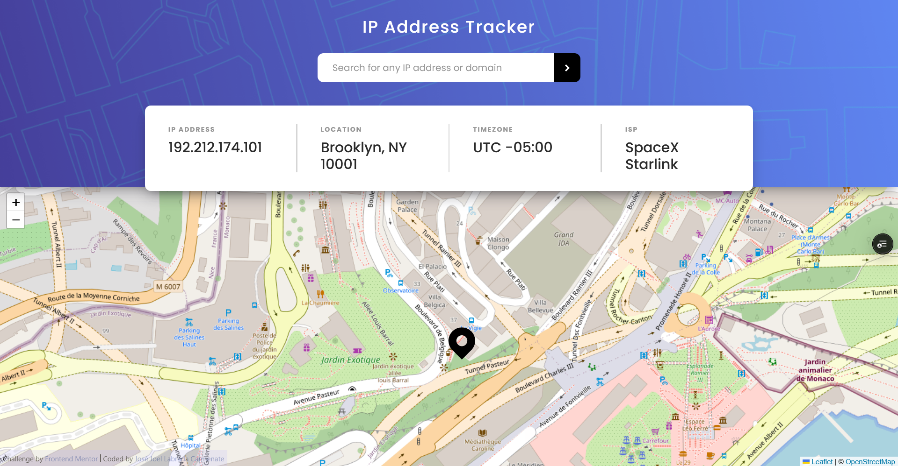

# Frontend Mentor - IP address tracker solution

This is a solution to the [IP address tracker challenge on Frontend Mentor](https://www.frontendmentor.io/challenges/ip-address-tracker-I8-0yYAH0). Frontend Mentor challenges help you improve your coding skills by building realistic projects. 

## Table of contents

- [Frontend Mentor - IP address tracker solution](#frontend-mentor---ip-address-tracker-solution)
  - [Table of contents](#table-of-contents)
  - [Overview](#overview)
    - [The challenge](#the-challenge)
    - [Screenshot](#screenshot)
    - [Links](#links)
  - [My process](#my-process)
    - [Built with](#built-with)
    - [What I learned](#what-i-learned)
  - [Author](#author)

## Overview

### The challenge

Users should be able to:

- View the optimal layout for each page depending on their device's screen size
- See hover states for all interactive elements on the page
- See their own IP address on the map on the initial page load
- Search for any IP addresses or domains and see the key information and location

### Screenshot

### Links

- Solution URL: [https://github.com/jojoboomer/frontend-projects](https://github.com/jojoboomer/frontend-projects)
- Live Site URL: [https://frontend-projects-self.vercel.app/ip-tracker](https://frontend-projects-self.vercel.app/ip-tracker)

## My process

### Built with

- [Vite](https://vite.dev/) - Build tool
- [Astro](https://astro.build/) - Framework
- [React](https://reactjs.org/) - JS library
- [Panda CSS](https://nextjs.org/) - Build-time CSS-in-JS library
- [IPify](https://www.ipify.org/) - IP Address API
- [Leaflet](https://leafletjs.com/) - JavaScript library interactive maps

### What I learned

This project gave me hands-on experience integrating two key technologies. I learned to fetch and handle real-time data using the IPify API to retrieve a user's public IP address. Simultaneously, I mastered the fundamentals of Leaflet.js to create dynamic, interactive maps. The core takeaway was successfully connecting these tools: using the IP geolocation data to visually plot and center the user's approximate location on a custom Leaflet map. This practical exercise strengthened my skills in working with external APIs, managing asynchronous JavaScript, and building data-driven, interactive web features.

## Author

- Website - [JoeBoomer](https://www.your-site.com)
- Frontend Mentor - [@jojoboomer](https://www.frontendmentor.io/profile/jojoboomer)
- Linkedin - [@joellabrada](https://www.linkedin.com/in/joellabrada/)
